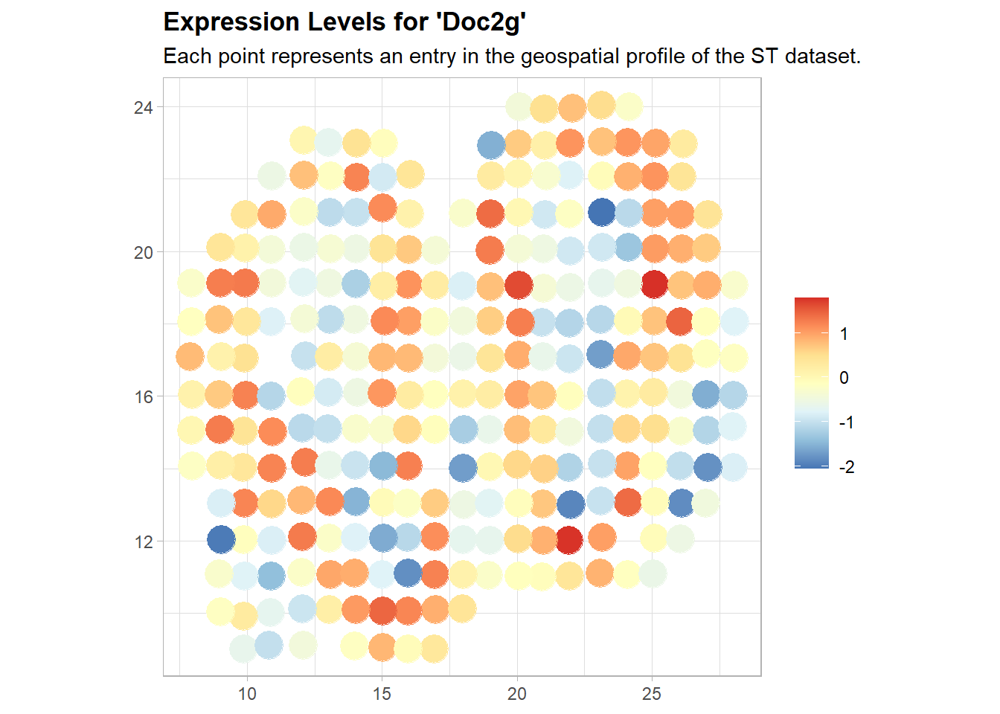

SV Gene Detection
===============================

boost package includes the functions of five SV gene identification methods: BOOST-GP, BOOST-Ising, SPARK, BinSpect and SpatialDE. The expression (count or normalized level) for one gene, and other information, are the inputs for these functions. We choose gene 'Doc2g' and show the SV gene detection process on it. 
::
    abs_expr <- count[, 'Doc2g']

BOOST-GP
------------------------------------------

BOOST-GP (Bayesian mOdeling Of Spatial Transcriptomics data via Gaussian Process) model requires the expression count for one gene (one column of the original count matrix :math:`Y`) and the location information :math:`T` as inputs. The estimated size factor is also an input for it. 
::
    result_boost_gp <- BOOST.GP(abs_expr, sample_info, size.factor = size_factor, gene.name = 'Doc2g', n.iter = 3000)
    
    print(result_boost_gp)
    ## 
    ## Call:
    ## BOOST.GP(abs.expr = abs_expr, spots = sample_info, size.factor = size_factor, 
    ##     gene.name = "Doc2g", n.iter = 3000)
    ## 
    ## Model: BOOST-GP 
    ## 
    ## Parameters:
    ##                                   Estimate Std. Error Lower 95% CI Upper 95% CI
    ## Dispersion                           10.99      3.400         6.90        21.71
    ## Normalized gene expression levels    25.69     15.030         6.04        58.97
    ## Kernel                                0.68      0.035         0.61         0.74
    ## 
    ## Bayes Factor in favor of a spatially variable gene: 1.9e+11
    ## p-value: 0

The outputs include the estimates of dispersion and kernel scale parameters in BOOST-GP model and also the mean normalized gene expression levels across spots. Bayes factor is the criteria for determining whether a gene is SV gene or not. If the output Bayes factor is greater than 150, we infer that it is SV gene. In this example, Bayes factor is extremely large, indicating strong evidence that gene 'Doc2g' is an SV gene.

BOOST-Ising
------------------------------------

Before applying BOOST-Ising (Bayesian mOdeling Of Spatial Transcriptomics data via a modified Ising model) method, several data pre-processing steps are required. Frist, we need to binarize the normalized expression level using binarize.st function.
::
    binary_expr <- binarize.st(normalized_count, 'Doc2g', cluster.method =  "GMC")

Instead of sample_info matrix, BOOST-Ising method requires the neighbor information of sample points. We apply get.neighbors function to generate the neighbor information. Sample points for this data are located on a square lattice, so each spots has 4 neighbors. 
::
    neighbor_info <- get.neighbors(sample_info, n.neighbors = 4, method = "distance")

BOOST-Ising requires the binarized expression level for one gene and the neighbor information as inputs. 
::
    result_boost_ising <- BOOST.Ising(binary_expr, neighbor_info, gene.name = 'Doc2g')

    print(result_boost_ising)
    ## 
    ## Call:
    ## BOOST.Ising(bin.expr = binary_expr, neighbor.info = neighbor_info, 
    ##     gene.name = "Doc2g")
    ## 
    ## Model: BOOST-Ising 
    ## 
    ## Parameters:
    ##                       Prior Mean Prior S.D. Estimate Std. Error Lower 95% CI
    ## First-Order Intensity          1        2.5     0.93       0.14         0.65
    ## Interaction                    0        1.0    -0.78       0.11        -1.00
    ##                       Upper 95% CI
    ## First-Order Intensity         1.20
    ## Interaction                  -0.58
    ## 
    ## Bayes Factor in favor of an attraction pattern: 1e+10
    ## p-value: <0.001

The outputs include the estimates of two parameters in BOOST-Ising model. Bayes factor is the criteria for determining whether a gene is SV gene or not. If the output Bayes factor is greater than 150, we infer that it is SV gene. In this example, Bayes factor is :math:`1\times 10^{10}`, indicating strong evidence that gene 'Doc2g' is an SV gene. 

BinSpect
----------------------------------
Same data pre-processing steps are required for BinSpect (Binary Spatial Extraction of genes from Giotto), including binarization and generating neighbor information. Like BOOST-Ising, Binspect requires the binarized expression level for one gene and the neighbor information as inputs. 
::
    result_binspect <- binSpect(binary_expr, neighbor_info, do.fisher.test = FALSE, gene.name = 'Doc2g')

    print(result_binspect)
    ## 
    ## Call:
    ## binSpect(bin.expr = binary_expr, neighbor.info = neighbor_info, 
    ##     do.fisher.test = FALSE, gene.name = "Doc2g")
    ## 
    ## Model: BinSpect 
    ## 
    ## Contingency Table for Classified Edges:
    ##     0   1
    ## 0 298 144
    ## 1 144 356
    ## 
    ## Odds ratio in favor of a spatially-variable pattern: 5.12
    ## p-value in favor of a spatially-variable pattern: <0.001

The outputs include the contingency table summarized from the neighbor pairing binarized expresssion. P-value is the criteria for determining whether a gene is SV gene or not. If the output p-value is less than 0.05, we infer that it is SV gene. In this example, p-value is less than $0.001$, indicating strong evidence that gene 'Doc2g' is an SV gene. 

SPARK
----------------------------

Like BOOST-GP, SPARK (Spatial PAttern Recognition via Kernels) requires the expression count for one gene (one column of the original count matrix :math:`Y`), the location information T, and the estimated size factor as inputs.
::
     result_SPARK <- SPARK(abs_expr, sample_info, size.factor = size_factor, gene.name = 'Doc2g')
     
     print(result_SPARK)
     ## 
     ## Call:
     ## SPARK(abs.expr = abs_expr, spots = sample_info, size.factor = size_factor, 
     ##     gene.name = "Doc2g")
     ## 
     ## Model: SPARK 
     ## 
     ## Summary:
     ##     GSP1   COS1    GSP2 COS2 GSP3 COS3 GSP4    COS4 GSP5    COS5
     ##  2.6e-09 0.0045 6.1e-05    1 0.12 0.24  0.6 3.9e-11 0.73 2.8e-11
     ## 
     ## p-value in favor of a spatially-variable pattern: <0.001

The outputs include the p-values under different kernel function settings. Combined p-value is the criteria for determining whether a gene is SV gene or not. If the output combined p-value is less than 0.05, we infer that it is SV gene. In this example, the combined p-value is less than 0.001, indicating strong evidence that gene 'Doc2g' is an SV gene. 

SpatialDE

SpatialDE method assumes the expression data are normally distributed. Instead of TSS normalization method, we need to use log-VST to normalize the data. This normalization method includes stabilizing the variance of counts data and regressing out the effect of library size.
::
    normalized_count_log_vst <- normalize.st(count, scaling.method = "log-VST")

    norm_expr <- normalized_count_log_vst[, 'Doc2g']

SpatialDE requires the normalized expression count for one gene and the location information $T$ as inputs.
::
   result_spatialde <- SpatialDE(norm_expr, sample_info, gene.name = 'Doc2g')
   
   print(result_spatialde)
   ## 
   ## Call:
   ## SpatialDE(norm.expr = norm_expr, spots = sample_info, gene.name = "Doc2g")
   ## 
   ## Model: SpatialDE 
   ## 
   ## Summary:
   ##      g   n  FSV   l BIC
   ##  Doc2g 260 0.57 1.1 609
   ## 
   ## p-value in favor of a spatially-variable pattern: <0.001

The outputs include the fraction of expression variance (FSV), characteristic length scale in the kernel function, and Bayesian information criterion. P-value is the criteria for determining whether a gene is SV gene or not. If the output p-value is less than 0.05, we infer that it is SV gene. In this example, the p-value is less than 0.001, indicating strong evidence that gene 'Doc2g' is an SV gene. 

Plot SV Gene
------------------------

Using plot.st, we can visualize the expression pattern for genes. In plot.st function, absolute count, normalized or binarized expression level, combined with the location information, are the inputs. If the input is binarized expression level, set parameter binary to TRUE. 
::
    st.plot(norm_expr, sample_info, gene.name = 'Doc2g', binary = FALSE, log.expr = FALSE)
    

